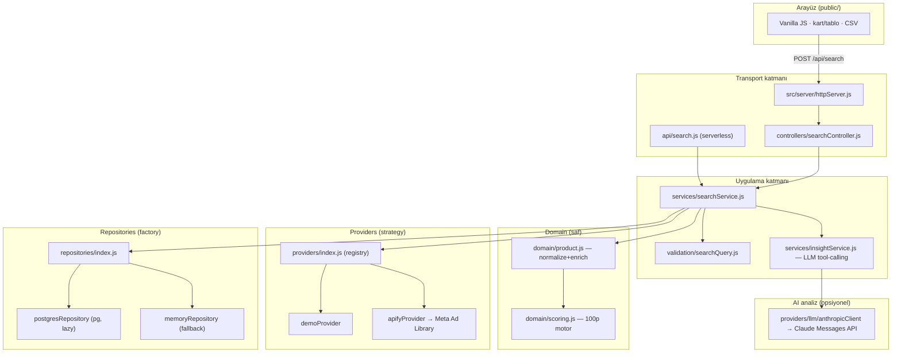
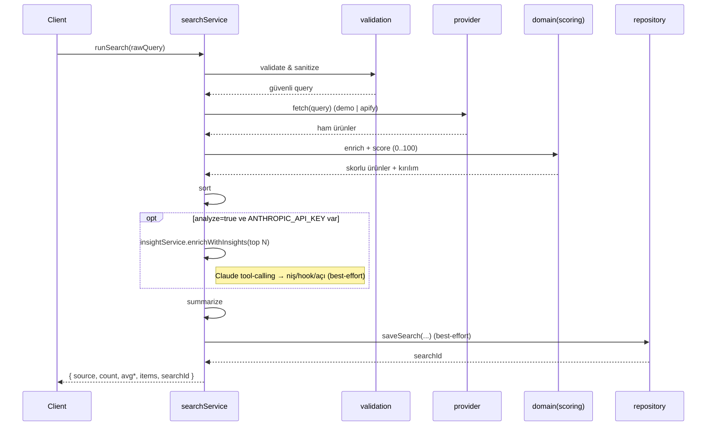
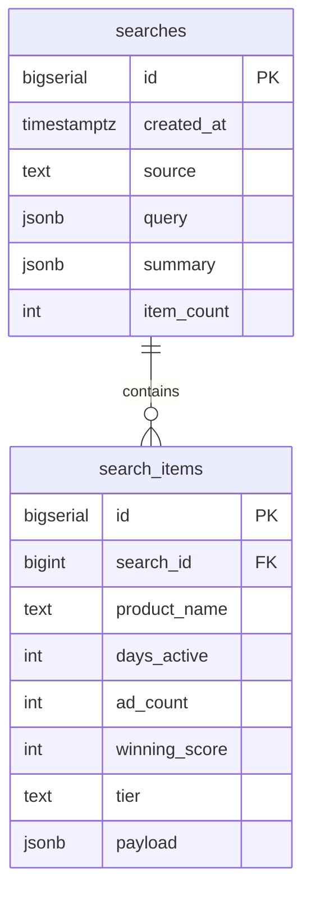

# Mimari — Winning Product Finder

Bu doküman sistemin **neden** bu şekilde yapılandırıldığını ve katmanların nasıl
ayrıştığını anlatır. Amaç: her problemi LLM'e atmadan, **deterministik olarak
çözülebilen kısmı kod tarafında** çözen; kaynak/depolama/transport'u birbirinden
bağımsız, test edilebilir ve genişletilebilir bir sistem.

## Tasarım prensipleri

1. **Katmanlı ve tek-yönlü bağımlılık.** Üst katman alt katmanı çağırır; tersi olmaz.
   `server → services → (providers | domain | repositories)`. Domain hiçbir şeyi bilmez.
2. **Transport'tan bağımsız iş mantığı.** Yerel HTTP sunucusu ve Vercel serverless
   fonksiyonu *aynı* `searchService.runSearch()`'i çağırır — kod tekrarı yok.
3. **Strategy ile açık/kapalı genişleme.** Yeni bir veri kaynağı = yeni bir provider
   + registry kaydı. Servis/HTTP değişmez.
4. **Graceful degradation.** DB yoksa in-memory'ye, canlı mod hatalıysa anlamlı
   502 + hint'e, persist hatası aramayı düşürmeden uyarıya düşer.
5. **Config-driven davranış.** Skor ağırlıkları, tavanlar, portlar, token'lar tek
   bir `config` modülünden gelir; `process.env`'e başka yerde dokunulmaz.

## Katmanlar

| Katman | Klasör | Sorumluluk |
|--------|--------|------------|
| Config | `src/config` | `.env` yükleme, tipli/doğrulanmış ayarlar, skor ağırlıkları |
| Domain | `src/domain` | Saf iş kuralları: `scoring` (100p motor), `product` modeli |
| Providers | `src/providers` | Kaynak adaptörleri (`demo`, `apify`) + `llm/` Anthropic istemcisi |
| Services | `src/services` | `searchService` (orchestration) + `insightService` (LLM tool-calling) |
| Repositories | `src/repositories` | Kalıcılık: `postgres` + `memory` + `factory` |
| Validation | `src/validation` | İstek doğrulama & sanitizasyon |
| Server | `src/server` | HTTP transport: sunucu, router, controller, statik |
| Utils | `src/utils` | `logger`, tipli `errors` |

## Bileşen ilişkileri

## Arama boru hattı (pipeline)

`searchService.runSearch()` şu deterministik adımları yürütür:

**Validate → Collect → Transform+Score → Sort → Persist → Output.** Her adımın
tek sorumluluğu vardır ve bir adımın çıktısı diğerinin girdisidir.

## Veri modeli

Şema: [`db/schema.sql`](./db/schema.sql). Supabase yönetilen bir Postgres olduğu
için aynı `pg` sürücüsü ve `DATABASE_URL` ile çalışır; ek istemci gerekmez.

## Neden LLM çekirdekte değil?

Skorlama sayısal ve deterministik olarak çözülebilir; bu yüzden `domain/scoring.js`
saf bir fonksiyondur (test edilebilir, tekrar-üretilebilir, ücretsiz). LLM ise yalnızca
gerçekten **anlamsal yorum** gereken adımda devreye girer: `insightService`, reklam
metninden niş/hook/açı çıkarımını **tool/function-calling** ile yapar — modelden serbest
metin değil, `record_ad_insight` şemasına uyan yapılandırılmış çıktı istenir (`tool_choice`
ile zorlanır). Bu adım opsiyonel (`analyze=true`), best-effort ve maliyet için yalnızca
sıralamanın en üstündeki N ürünle sınırlıdır; anahtar yoksa sessizce kapanır. Bu ayrım
maliyeti düşürür ve deterministik çekirdeği açıklanabilir tutar.
`automation/n8n-facebook-ads-workflow.json`, bu boru hattının no-code/agentic bir
varyantını (Apify → normalize → analiz) referans olarak içerir.

## Güvenlik notları

- Sırlar `.gitignore` ile dışlanır (`.env`, `.mcp.json`, `*.key`, `*.pem`, `secrets/`).
- Apify token'ı sunucu env'inde tutulur; arayüz girişi opsiyonel kolaylıktır.
- Girdi doğrulama, gövde-boyutu sınırı ve statik sunumda path-traversal koruması vardır.
- DB kimlik bilgileri yalnızca `DATABASE_URL`/Supabase env'inde; koda gömülmez.
